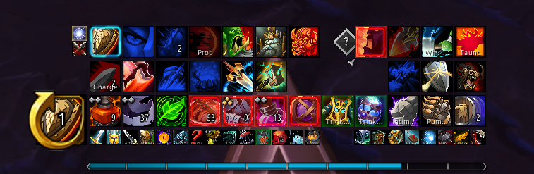

# Prep

Highlights action bar buttons for missing buff, food, weapon enchant, flask and rune.

## Usage

Only works outside combat currently.

- `/prep`: shows usage
- `/prep buff <spell id/link/name>`: set buff to track
- `/prep food <item id/link/name>`: set food to track
- `/prep weapon <item id/link/name>`: set weapon enchant to track
- `/prep flask <item id/link/name>`: set flask to track
- `/prep rune <item id/link/name>`: set rune to track
- `/prep clear <buff/food/weapon/flask/rune>`: clear type
- `/prep group`: toggle group buff check
- `/prep alpha <a>`: set highlight alpha (0.0 - 1.0)
- `/prep color <r g b>`: set highlight color (0.0 - 1.0)
- `/prep status`: show current status